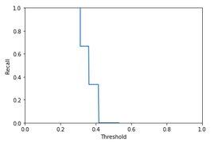
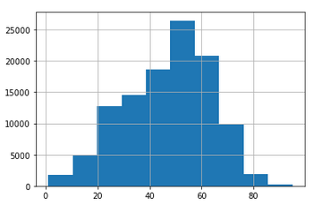
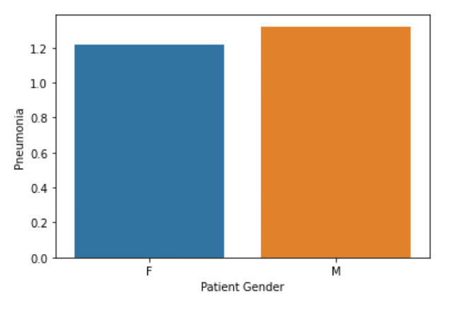

# FDA  Submission

**Your Name:** Ismail Elouafiq

**Name of your Device:** Xhale-001

## Algorithm Description 

### 1. General Information

**Intended Use Statement:** 
The Xhale-001 system is intended to be used in a clinical setting to prioritize the workflow of chest X-rays that will be reviewed by the hospital's radiologists. The Xhale-001 uses a machine learning algorithm to analyze chest X-ray images for features suggestive of Pneumonia. 

The Xhale-001 is intended to be used on digital X-ray chest images. The result of the Xhale-001 is not conclusive, the identification of cases of Pneumonia is not intended for diagnostic use. The result of the Xhale-001 is intended to be used to prioritize chest X-ray images that show a possibility of pneumonia. Thus Xhale-001 should not be used to replace a patient's evaluation, nor to make, confirm or reject diagnoses.

**Indications for Use:**
Xhale-001 is indicated for detecting pneumonia in chest X-ray images of the chest for males and females between the ages of 1 and 95. The images must be using a 'DX' modality and in the viewing positions 'PA' or 'AP'.

**Device Limitations:**
* Xhale-001 must be run on a computer that meets the minimum GPU and RAM requirements.
* Xhale-001 can only be used on Chest X-ray data.
* Due to a high level of comorbidity, Infiltration can be highly confused with Pneumonia by the Xhale-001. Pneumonia can also be slightly confused with Edema, Effusion and Atelectasis.
* Certain unknowns that impact the X-ray chest image such as persons in pregnancy were not considered and may produce unexpected results.

**Clinical Impact of Performance:**

The Xhale-001 was designed to avoid False Negatives as much as possible, this tradeoff however errs in the side of False Positives. This means that the Xhale-001 will tend to suspect the presence of pneumonia in patients that do not have the condition. 

The results of the Xhale-001 are designed to be used within workflow prioritization to sort out patients that are more likely to have Pneumonia. All of the X-ray images must later be reviewed by a radiologist and must never be used as a diagnosis. Radiologists shall not be biased by the result of the Xhale-001 as it may mislead their diagnosis. Radiologists must review the X-ray images independently of the result of the Xhale-001.

### 2. Algorithm Design and Function

*Figure 1 - Xhale-001 Algorithm Flow Chart.*

**DICOM Checking Steps:**

Check DICOM Headers for:
* `Modality` is equal to: `DX`
* `BodyPartExamined` is equal to: `CHEST`
* `PatientPosition` is equal to either: `PA` or `AP`.

If any of the above is false, the DICOM file is skipped.

**Preprocessing Steps:**
* The pixel array in the DICOM file is used.
* The pixel array is rescaled by a factor of 1/255
* The pixel array is normalized
* The pixel array is resized to a width of 224 and a height of 224.

**CNN Architecture:**
We use a pretrained VGG16 model and we fine-tune it for our use case. 
* We used a pretrained VGG16 model where freeze the first 17 layers.
* We add a `BatchNormalization` step.
* We add a relu `Dense` layer of size 1024. 
* We add a `Dropout` layer (0.5) to avoid overfitting.
* We add a relu `Dense` layer of size 512.
* We add another `Dropout` layer (0.5).
* We add a relu `Dense` layer of size 256. 
* We add another `Dropout` layer (0.5). 
* We add a `Dense` layer of size 1 to get the output using a sigmoid function.

### 3. Algorithm Training

**Parameters:**
* During the learning, we use a learning rate of `0.0001`.
* The loss function used is binary crossentropy.
* The optimizer used is the Adam optimizer (Adaptive Moment Estimation)
* The images used for training are augmented. Validation data is only augmented using rescaling. Training data is augmented using the keras image data augmentation with a rotation of 20, a horizontal flip (no vertical flip), a height_shift_range of 0.1, a width_shift_range of 0.1, a shear_range of 0.1, and finally a zoom_range of 0.1
* We use a batch size of 64.
* We use 100 steps per epoch with a maximum of 20 epochs, and 10 validation steps.
* The algorithm stops at the 19th epoch.
* We use a threshold of 0.25 on the output to predict pneumonia.

*Figure 2 - Algorithm training performance.*

*Figure 3 - Precision-Recall curve.*

*Figure 4 - ROC curve.*

**Final Threshold and Explanation:**

We decide to choose a threshold of 0.25

*Figure 5 - Recall by threshold*

This is because in Xhale-001 we decide to focus on higher sensitivity (recall). This is done to avoid missing any positive cases and avoid False Negatives (which in this case would mean not prioritizing a patient that has pneumonia).
As a consequence the Xhale-001 may end up identifying an image as containing pneumonia more often. On the other hand, it is less likely to miss an image containing pneumonia.

*Figure 6 - Example prediction on a batch of 256 images.*

*Figure 7 - Example prediction on a batch of 256 images.*
### 4. Databases
The original dataset used has

* Age distribution: we truncate the dataset to remove the patients whose age is not reasonable such as patients that seem to be 414 years old. This is because it may indicate that there are other possible data collection issues with these samples. With that removed the age distribution is shown below. 

*Figure 8 - Age distribution with extremes removed.*
The age has a mean of approximately 47, and a standard deviation of 16.
The age seems to be distributed similarly accross the population with and without pneumonia as shown below:

*Figure 9 - Age box plots by occurance of penumonia.*

* Comorbidity: Infiltration is commonly found with Pneumonia and is present in 42% of the Pneumonia cases. It is directly followed by Edema (24%), Effusion (19%) and Atelectasis (18%) as shown below.

*Figure 10 - Comorbidity of other diseases with pneumonia.*

* Gender distirbution: The dataset contains 57% male patients and 43% female patients. The occurence of pneumonia in both seems to be slightly different: 1.3% in males and 1.2% in females. 

*Figure 11 - Age box plots by occurance of penumonia.*

* Training/Validation split: we split the data into 80% training data and 20% validation data.

**Description of Training Dataset:** 
* The prevalence of Pneumonia is very low in the dataset. Only approximately 1.28% of the images are positive cases of pneumonia. We want to have half the images be positive cases and the other half be negative cases. For this reason, we keep all positive pneumonia cases and we randomly select an equal number of negative pneumonia cases. As a result, we are excluding a large amount of data, and are only left with 2288 training images of which 1144 are positive cases of pneumonia and 1144 are negative cases of pneumonia.

**Description of Validation Dataset:** 
The prevalence of positive cases of pneumonia in the validation set must be representative of the real world. We verify that the amount of postivie cases in the validation set is similar to the original dataset: 1.28%. Note that this is not necessarily representative of the real world, but it is representative of the ground truth described in the next section (Section 5).

### 5. Ground Truth
The ground truth for the existence of pneumonia was obtained from a labeled dataset of X-Ray images provided by the NIH that can be found here: https://www.kaggle.com/nih-chest-xrays/data . 

* The dataset contains in total 112120 images.
* There are 30805 unique patient IDs in the dataset.
* The disease labels were obtained through the use of Natural Language Processing to text-mine disease classifications from the radiologist reports of the X-ray images.
* This implies that it's possible not all disease labels are correct and thus pneumonia labels may not be correct. However, the labels are expected to be >90% accurate and suitable for weakly-supervised learning. 
* Even with the last constraint this dataset contains more than previous initiatives such as https://openi.nlm.nih.gov/
* The original reports from which the labels were created are however not available and thus cannot be verified.

### 6. FDA Validation Plan

**Patient Population Description for FDA Validation Dataset:**

The intended patient population must fulfill the following criteria:
* The prevalence of pneumonia is close to 1.273% in the whole dataset.
* The age is between 1-100, with a mean close to 47 and a standard deviation of 16.
* Male and female populations are both present in nearly equal amounts.

**Ground Truth Acquisition Methodology:**

Establish a silver standard by getting the results of 4 radiologist reviews. The results of these reviews will be averaged. The radiologists will have at least two years of experience and the average will not be weighted by experience.

**Algorithm Performance Standard:**

Based on previous work from [[Rajpurkar et al. 2017]](https://arxiv.org/pdf/1711.05225.pdf), we want an F1-score higher than 0.435, which is the performance of the provided algorithm (the radiologist average is 0.387).
